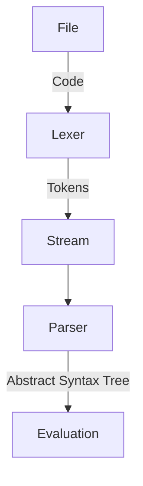

# Molt: a Math Oriented Language Tool

[Chloe Halverson](https://github.com/chlohal) - [Mai Le Vu](https://github.com/mai-Le-Vu) - [William Titus](https://github.com/tippyToo)

## What is Molt?

Molt is a simple programming language. There are two versions of Molt: "Ideal Molt", which is a hybrid-procedural-logical programming language, and "Procedural Molt", which is a subset of Ideal Molt and a procedural programming language. This repo contains the specification for Ideal Molt and a Python implementation for Procedural Molt.

Molt's syntax is inspired by Python as a starting point, with some modifications to make parsing easier (e.g. the usage of curly brackets rather than significant whitespace). Molt prioritizes pure functions and forbids side effects. Side effects are only produced by top-level statements; everything else is an expression. 

Molt supports sets, functions, and numbers as first-class values. 

## Usage: Molt CLI

After cloning the repository (an, optionally, [installing](#installation)), run the module `molt` with Python 3. Molt takes 1 required argument on the command line: the name of a file to run.

```console
user@computer: ~/molt-lang $ python3 molt example/sqrt.molt
2.82842712474619
2
```

If a directory is given, Molt will search it for a `main.molt` file. 

```console
user@computer: ~/molt-lang $ python3 molt example
2.82842712474619  # sqrt(8)
2  # sqrt(4)
```

If no argument is given at all, then Molt will search the current directory.

```console
user@computer: ~/molt-lang $ python3 molt
Exception: C:\Users\coleh\molt-lang is a directory and no file 'main.molt' found
```

### `--explain`

Molt also supports the optional `--explain` argument, which may be given *after* the file to "explain" evaluations.

```console
user@computer: ~/molt-lang $ python3 molt example/sqrt.molt --explain
2.82842712474619  # sqrt(8)
2  # sqrt(4)
```

### Installation

Molt may be installed as a command. It still depends on Python *being installed*, but can be run without directly referencing Python.

```console
user@computer: ~/molt-lang $ python3 installer
Bundling for installation...
Installing...
Done!
user@computer: ~/molt-lang $ molt example/hello.molt
0.2222222222222222
```

## Molt Language

This section documents the Implemented Molt language. The specification for the superset language, in EBNF format, is in [spec.md](./spec.md). 

Molt files may be named any legal file name, but **MUST** end with `.molt`. Molt files are composed of 0 or more statements. Statements **SHOULD** be separated by newlines. 

Whitespace is entirely ignored in Molt.

There are currently supported 3 statements:

### `let` statement

`let` statements define variables. A `let` statement is written as such: 

```js
let x = 3
```

and defined with the following format:

```ebnf
let ::= "let" variable "=" expression
```

`let` statements will evaluate their expression and assign its result to the given variable.

### `eval` statement

`eval` statements evaluate expressions and output the result. An `eval` statement can be written as follows:

```js
eval 2 + 3

let x = 3
eval 2 + x
```

and is defined with the following format:

```ebnf
eval ::= ["eval"] expression
```

If `eval` is used with an undefined variable, it will return an error

### `def` statement

A `def` statement will define a function, similar to Python. A simple `def` statement can be written as follows:

```python
def d(x) = 3 * x
def foo(x) = { 
		 3 * x
}
```

and is defined with the following format:

```ebnf
simple_def ::= "def" variable "(" variable {"," variable} ")" "=" expression /
"def" variable "(" variable {"," variable} ")" "=" "{" expression "}"
```

The brackets are optional: if programmers want to use them for clarity, they may, but they are not required. `def d(x) = 3` is still valid if there is a newline after the equals sign.

A `def` statement constructs a function value, using the parenthesized variables as its arguments and the expression as its body, and assigns the function to the given variable.

#### Piecewise Definitions

In Molt, piecewise definitions serve the purpose which `if` statements fill in other languages. A piecewise function is defined as follows:

```python
def d(x) = {
	x > 0: 2,
	x == 0: 1,
	0
}
```

This is equivalent to the following python code:

```python
def d(x):
    if x > 0:
        return 2
    elif x == 0:
        return 1
	else:
	    return 0
```

A piecewise function will do the following:

- Evaluate the first condition. If it is true, then evaluate its expression and yield the result. Otherwise, repeat with the next condition.
- If the last condition is reached and not true, then the `else` clause is evaluated and yielded. If there is no final expression, the function is undefined.

The **OPTIONAL** `else` clause of a piecewise function **MUST** be last.

With piecewise functions, the brackets are mandatory.

A piecewise function is defined as follows:

```ebnf
piecewise_term ::= condition ":" expression
piecewise_def ::= "def" variable "(" variable {"," variable} ")" "=" "{" piecewise_term {"," piecewise_term} [expression] "}"
```

Note that again, whitespace is entirely ignored.

### Expressions

**TL:DR: most simple math expressions *Just Work™️* in Molt.**

The following is a table of all operators implemented in Molt, sorted by precedence.

All operators are left-associative, except for exponentiation (`^`) and the modulo operator (`%`), which are not associative at all (i.e. `3^5^7` is a syntax error). The rationale behind this is consistency: some languages have a left-associative exponentiation operator and some have a right-associative one. Rather than make a decision which would alienate a subset of developers, Molt encourages clarity by requiring `(3^5)^7` or `3^(5^7)`.

| Operator | Name           | Supported Synonyms | Example                                         | Notes                                                                                                      |            |
| -------- | -------------- | ------------------ | ----------------------------------------------- | ---------------------------------------------------------------------------------------------------------- | ---------- |
| `+`      | Addition       |                    | `3 + 2` &rarr; `5`                              |                                                                                                            |            |
| `-`      | Subtraction    |                    | `2 - 1` &rarr; `1`, `{2,1} - {1}` &rarr; `{2}`  | When given two numbers, is the subtraction operation. When given two sets, it is the difference operation. |            |
| `*`      | Multiplication | `×`, `⋅`, `✕`      | `3 * 2` &rarr; `6`                              |                                                                                                            |            |
| `/`      | Division       | `÷`                | `6 / 3` &rarr; `2`                              |                                                                                                            |            |
| `%`      | Modulo         |                    | `10 % 3` &rarr; `1`, `(20 % 11) % 4` &rarr; `1` | Not associative, must use parenthesis for multiple operations.                                             |            |
| `^`      | Exponentiation |                    | `3 ^ 2` &rarr; `9`, `(2 ^ 3) ^ 2` &rarr; `64`   | Not associative, must use parenthesis for multiple operations.                                             |            |
| `&&`     | Intersection   | `&`, `/\`, `∩`     | `{1,2,3} && {3,4,5}` &rarr; `{3}`               |                                                                                                            |            |
| `\|\|`   | Union          | `\|`, `\/`, `∪`    | `{1,2,3} \|\| {3,4,5}` &rarr; `{1,2,3,4,5}`     |                                                                                                            |  |

### Values

Molt's implemented subset supports 4 types of values.

#### Numbers 

Numbers are the most basic type of value. A number may be written as such:

```python
3
-2.0
26.3425
```

Exponential notation (e.g. `2e5`) is not supported: instead, users are advised to use `2 * 10^5`.

#### Symbols

When an unbound variable is evaluated, it yields a symbol. Symbols are a special data type which symbolizes a name. **Symbols may only be compared by equality.**

```python
def f(x) = {
	x < 0: left
	x = 0: center
	x > 0: right
}

eval f(-2) # prints 'left'
```

Support for symbols allows Molt to implicitly support enums and lifts responsibility from the user. For example, when defining a function, the user may want to use special sentinel values to change the behaviour. Instead of requiring them to define each sentinel as a different variable (e.g. `let left = -1 let center = 0 let right = 1`), symbols make the task frictionless.

#### Finite Sets

A finite set is written as such:

```python
let finite_set = { 1, 2, 3 } # the set that contains 1, 2, and 3
```

#### Functions

A function expression may be written like so:

```python
x => 3 
# Piecewise is valid
x => {
    x > 2: 1,
    9
}
```

Even functions defined with `def` are function values. The code `def d(x) = 2` is *exactly equivalent* to the code `let d = x => 2`. The only difference is that function expressions may not have more than one argument.

Because functions are first-class values, they may be used to store data. The following code approximates a dictionary in Molt.

```python
# Returns a new dictionary with the new key/value pair.
# Molt forbids side effects, so returning a new dictionary is
# the best way to implement the structure!
def put(dictionary, key, val) = (
	get_key => {
		get_key = key: val,
		dictionary(get_key)
	}
)

def get(dictionary, key) = dictionary(key)

def dict(default) = (
	get_key => default
)
```


### Conditions

Unlike most languages, where conditions *are* expressions (for example, in Javascript, `2 == 2` is `true`), Molt keeps conditions separated. 

The following is a description of all conditional operators:

| Operator | Name                | Supported Synonyms | Notes                                                                                                |
| -------- | ------------------- | ------------------ | ---------------------------------------------------------------------------------------------------- |
| `=`      | Equality            | `==`               | Unlike most languages, `2 = 2` is the same as `2 == 2`. This facilitates easier use for mathematics. |
| `<`      | Less Than           |                    |                                                                                                      |
| `<=`     | Less or Equal To    |                    |                                                                                                      |
| `>`      | Greater Than        |                    |                                                                                                      |
| `>=`     | Greater or Equal To |                    |                                                                                                      |
| `!=`     | Not Equals          | `/=`               |                                                                                                      |
| `in`     | Set Membership      |                    | The right side of the `in` operator **must** be a set                                                |
| `<<=`    | Subset              | `⊆`                |                                                                                                      |
| `<<`     | Proper Subset       | `<<<`, `⊂`         |                                                                                                      |
| `>>=`    | Superset            | `⊇`                |                                                                                                      |
| `>>`     | Proper Superset     | `>>>`, `⊃`         |                                                                                                      |

## Program Design

### Structure

The Molt interpreter follows this structure:



First, a file is read. This file gets passed to the lexer.

#### Lexer

With Molt code, `3 == 3` is the same as `3 = 3`. `let x = 2` is the same as `let x=2`. Therefore, we want to provide a layer of abstraction to make understanding it easier.

The lexer serves this purpose: it goes through the file, splitting the text into meaningful "tokens" and assigning each token a name. `==` and `=` both have the name `equals`, so they will have the same purpose. 

The lexer also throws away comments, so we don't have to worry about parsing them later on.

#### Token Stream

Looping through each token is the best way to analyse the file, but we don't want to have one big `for` loop. That would be inelegant and awkward to code. Instead, we created a `TokenStream` data structure, which has the methods `peek()` and `pop()`.

Popping takes the next token from the list, while peeking only *looks* at the next token, keeping the current position in the list. Since the `TokenStream` can peek at the next token, but can't peek further, we say it has 1 token of lookahead and that ours is an `LL(1)` parser.

#### Parser

The parser's job is to use the TokenStream to produce an Abstract Syntax Tree for the evaluator. In order to minimise complications, we split the parser's responsibilities into several files.

The Statement Parser handles the parsing of each statement. Based on the first token, it decides what type of statement the function is, and it delegates to specific parsers based on that type.

The Condition Parser handles the parsing of conditions. This is one of our more simple parsers, and only serves to create a logical separation from the expression parser.

The Function Body Parser is an odd parser. It's rather complicated in order to distinguish between `def f(x) = { 3 }` (a simple expression in optional brackets), `def f(x) = { 3, 2, 1 }` (a finite set), and `def f(x) = { 3=x: 2, 0 }` (a piecewise function). This distinction was planned for-- in fact, that's partially why conditions aren't expressions in Molt-- but it's still non-trivial.

The Expression Parser is one of the most complicated parsers. It must parse expressions like `3 + 2 * 8` successfully, keeping in mind associativity and precedence. To do that, it follows a technique called "Pratt parsing", where each operator is handled by a separate function and the main parser only serves to connect these pieces of logic together. Precedence is also handled seperately. This separation of concerns lets us easily manipulate the form of expressions in Molt.

The expression parser is also designed to prioritize left-associative operators and infix operators.

#### Abstract Syntax Tree

An Abstract Syntax Tree (AST) is a model of how the program looks logically. For example, a tree could have a "root node" which contains a list of "statement nodes", each of which contain information on their contents.

We made each type of node its own class, and gave each type its own file. This practice made our code very well-structured, but it also contributed 78% of our Python files!

#### Evaluator

After an AST is produced, then our Molt interpreter has a view of the logical structure of the program. Using this, it can evaluate the program.

We chose to link the evaluation to the AST in a concrete way: each AST node class has a method (either `run`, `evaluate`, or `check`, which corresponds to statements, expressions, and conditions, respectively) that "does" that AST node.

That made our code easy to reason about, at the cost of some performance.

### Known Issues

- Infinite sets are supported by the parser, but cause an error when evaluated.
- Because of the degree of type annotations, Python complains of circular imports.
	- We don't actually *use* anything in a circular manner, but type annotations require imports regardless. Currently, we fix this by bundling all python files into a single file at runtime, which then gets ran with `exec()`. The bundled result is saved so that it may be used as a standalone file for subsequent runs.
- In some rare contexts, the `==` condition causes errors. This issue is intermittent.
- Since Python doesn't support unbounded recursion, then looping (e.g. with `def f(x) = { x > 0 : f(x-1), 3 } eval f(300)`) will fail if the loop goes too high.
- Exponentiation is left-associative, in violation of the specification.
- Installation may require restart on Windows 11

## Future Extensions

- Currently, execution is handled with a recursive descent evaluation strategy. If we had a bytecode interpreter, we wouldn't be beholden to Python's limitations on stack size and TCO: our implementation could provide unbounded recursion.
- Functions created with the function construction operator `=>` may only contain 1 bound variable. Currying (e.g. `a=>b=>a*b`) is possible, but we do not perform it automatically when evaluating `(a=>b=>a*b)(1,2)`. We should either expand the parser to allow `(a,b)=>a*b` or support easy currying.
- Originally, a symbolic solving engine was intended as a core feature of Molt. Implementing this is a good idea for a future extension.
- A broad refactor of the project to prevent the circular reference errors and make the bundler obsolete.
- Importing of other Molt files
- Implementation of more of Ideal Molt
	- Infinite sets

## Contributions

- Mai:
	- Lexer
	- Token design & naming
	- Specification
	- Expression parser
- Chloe:
	- Statement parser
	- Specification
	- Function body parser
	- Documentation
- William:
	- Expression evaluation
	- Specification and format work
	- `argv` handling & file search process
	- Comments, docstring
## References & Acknowledgments

- Thank you to Bob Nystrom for his [article on Pratt Parsing](http://journal.stuffwithstuff.com/2011/03/19/pratt-parsers-expression-parsing-made-easy/), which helped a *lot* in the implementation of our expression parser, and his book, [Crafting Interpreters](https://craftinginterpreters.com/) (which we didn't reference directly, but is a wonderful text to help with *how* to make a language).
- Thanks to [Phoebe](github.com/bigTandy) for finding Molt on GitHub & helping with testing and bug-hunting
- Thanks to @spookygirlwithukulele for helping with Linux testing